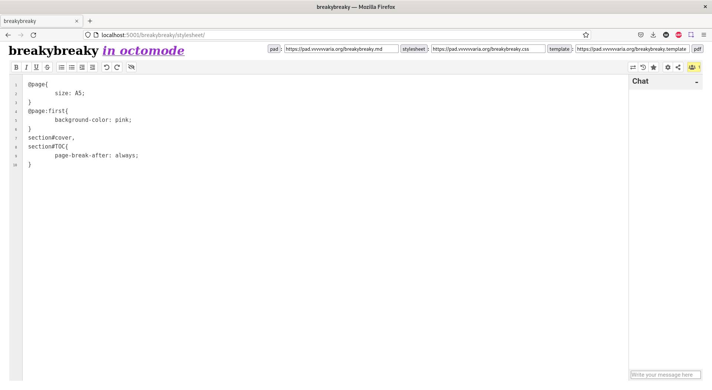

# Octomode 

*work-in-process*

Octomode is a collective editing space for PDF making, using Etherpad, Paged.js and Flask. 

## Use octomode locally

`make setup` (sets up a virtual environment and install the requirements)

`make run` (runs the Flask application)

Open the application at <http://localhost:5001>.

## Dependencies

`python` dependencies are listed in `requirements.txt`

## Use octomode on a server

* Configure the webserver to listen to the port of the flask application, for example with a subdomain
* Expand the current https certificate for a subdomain
* Restart nginx (`sudo service reload nginx`)
* To keep the flask application running in the background: add a new config to supervisor (`cp /etc/supervisor/conf.d/previousexample.conf new.conf`)
* Restart supervisor (`sudo service reload supervisor`)

# Refs

* Ethertoff http://osp.kitchen/tools/ethertoff/ by OSP
* Etherbox https://networksofonesown.constantvzw.org/ by Michael Murtaugh/Constant
* Etherdump https://gitlab.constantvzw.org/aa/etherdump by Michael Murtaugh/Constant
* Pad2Print https://gitlab.com/Luuse/pad2print by Luuse
* JupyterPi https://git.xpub.nl/XPUB/jupyterpi by Michael Murtaugh/XPUB

# Snapshots

